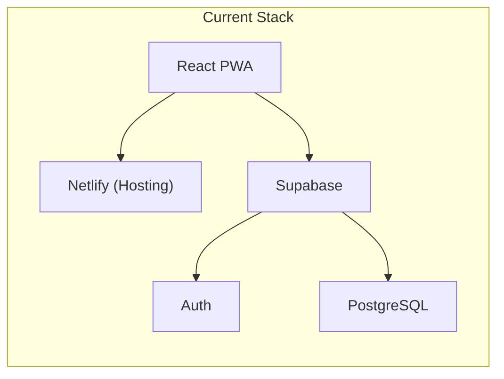
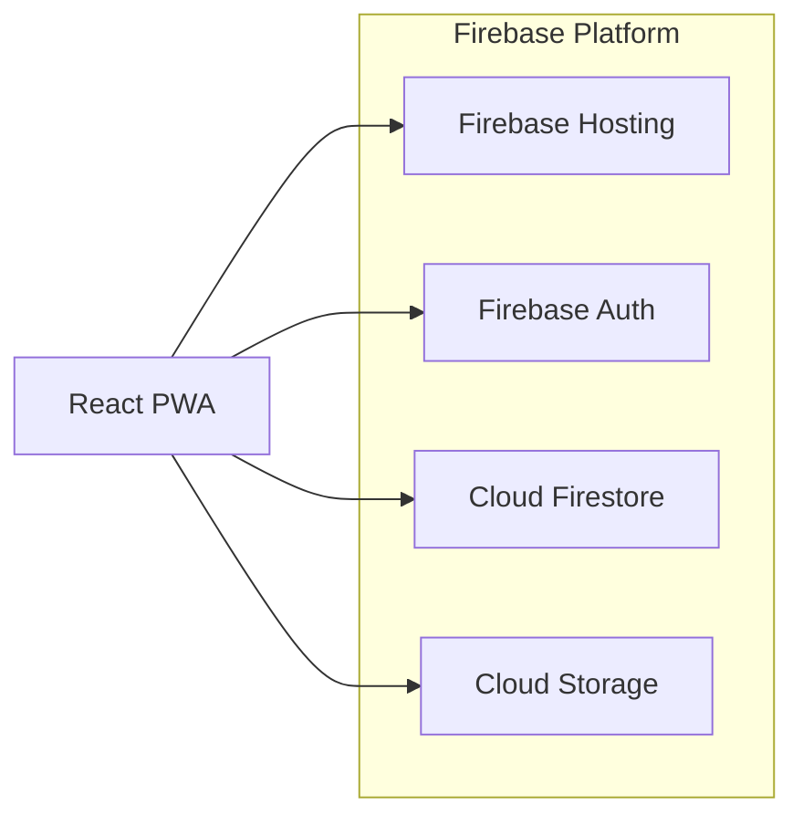

# Firebase Migration Plan

## Executive Summary

Migrate **Bookea Reads** from Supabase + Netlify to **Firebase** for:
- Unified platform (hosting + database + auth + storage)
- Native Google Sign-In support
- No capacity warnings (Netlify at 50%+)
- No inactivity pausing (Supabase free tier pauses after 7 days)

**Estimated effort**: 2-3 weeks

---

## Current Architecture



### Current Database Schema (Supabase PostgreSQL)

| Table | Purpose | Columns |
|-------|---------|---------|
| `books` | Book catalog | id, user_id, title, author, cover, status, progress, total_pages, total_chapters, rating, spice_rating, is_owned, is_favorite, to_buy, price, review, format, genres[], added_at, started_at, finished_at, paused_at, dnf_at, updated_at |
| `notes` | Book notes | id, user_id, book_id, content, date, created_at |
| `reading_sessions` | Timer sessions | id, user_id, book_id, duration_minutes, pages_read, started_at, ended_at, created_at |
| `user_goals` | Reading goals | id, user_id, year, yearly_goal, monthly_goal, created_at |

---

## Target Architecture



---

## Migration Steps

### Phase 1: Firebase Project Setup

#### 1.1 Create Firebase Project
```bash
# Install Firebase CLI
npm install -g firebase-tools

# Login to Firebase
firebase login

# Initialize project in Reading App directory
cd "c:\Users\liliz\Documents\Reading App"
firebase init
```

Select:
- ✅ Firestore
- ✅ Hosting
- ✅ Storage
- ✅ Authentication (configure in console)

#### 1.2 Install Firebase SDK
```bash
npm uninstall @supabase/supabase-js
npm install firebase
```

#### 1.3 Create Firebase Config

**[NEW] `src/lib/firebaseClient.js`**
```javascript
import { initializeApp } from 'firebase/app';
import { getAuth, GoogleAuthProvider } from 'firebase/auth';
import { getFirestore } from 'firebase/firestore';
import { getStorage } from 'firebase/storage';

const firebaseConfig = {
  apiKey: import.meta.env.VITE_FIREBASE_API_KEY,
  authDomain: import.meta.env.VITE_FIREBASE_AUTH_DOMAIN,
  projectId: import.meta.env.VITE_FIREBASE_PROJECT_ID,
  storageBucket: import.meta.env.VITE_FIREBASE_STORAGE_BUCKET,
  messagingSenderId: import.meta.env.VITE_FIREBASE_MESSAGING_SENDER_ID,
  appId: import.meta.env.VITE_FIREBASE_APP_ID
};

const app = initializeApp(firebaseConfig);

export const auth = getAuth(app);
export const googleProvider = new GoogleAuthProvider();
export const db = getFirestore(app);
export const storage = getStorage(app);
```

#### 1.4 Update Environment Variables

**[MODIFY] `.env`**
```env
# Remove Supabase vars
# VITE_SUPABASE_URL=...
# VITE_SUPABASE_ANON_KEY=...

# Add Firebase vars
VITE_FIREBASE_API_KEY=your-api-key
VITE_FIREBASE_AUTH_DOMAIN=your-project.firebaseapp.com
VITE_FIREBASE_PROJECT_ID=your-project-id
VITE_FIREBASE_STORAGE_BUCKET=your-project.appspot.com
VITE_FIREBASE_MESSAGING_SENDER_ID=your-sender-id
VITE_FIREBASE_APP_ID=your-app-id
```

---

### Phase 2: Firestore Data Model

Firestore uses collections/documents (NoSQL) instead of tables (SQL).

```
/users/{userId}
  - email
  - displayName
  - avatar
  - createdAt

/users/{userId}/books/{bookId}
  - title
  - author
  - cover
  - status: "reading" | "read" | "want-to-read" | "paused" | "dnf"
  - progress
  - totalPages
  - totalChapters
  - rating
  - spiceRating
  - isOwned
  - isFavorite
  - toBuy
  - price
  - review
  - format
  - genres[]
  - addedAt
  - startedAt
  - finishedAt
  - pausedAt
  - dnfAt
  - updatedAt

/users/{userId}/books/{bookId}/notes/{noteId}
  - content
  - date
  - createdAt

/users/{userId}/books/{bookId}/sessions/{sessionId}
  - durationMinutes
  - pagesRead
  - startedAt
  - endedAt

/users/{userId}/goals/{year}
  - yearlyGoal
  - monthlyGoal
  - createdAt
```

#### Firestore Security Rules

**[NEW] `firestore.rules`**
```
rules_version = '2';
service cloud.firestore {
  match /databases/{database}/documents {
    // Users can only access their own data
    match /users/{userId}/{document=**} {
      allow read, write: if request.auth != null && request.auth.uid == userId;
    }
  }
}
```

---

### Phase 3: Auth Migration

#### 3.1 Replace AuthContext

**[MODIFY] `src/context/AuthContext.jsx`**

Key changes:
- Replace `supabase.auth` → Firebase `auth` module
- Add Google Sign-In support
- Update session handling

```javascript
import { auth, googleProvider } from '../lib/firebaseClient';
import { 
  signInWithEmailAndPassword,
  createUserWithEmailAndPassword,
  signInWithPopup,
  signOut as firebaseSignOut,
  onAuthStateChanged
} from 'firebase/auth';

// Replace supabase.auth.signInWithPassword
const signIn = async (email, password) => {
  const userCredential = await signInWithEmailAndPassword(auth, email, password);
  return userCredential.user;
};

// Add Google Sign-In
const signInWithGoogle = async () => {
  const result = await signInWithPopup(auth, googleProvider);
  return result.user;
};

// Replace onAuthStateChange
useEffect(() => {
  const unsubscribe = onAuthStateChanged(auth, (user) => {
    setUser(user);
    setLoading(false);
  });
  return () => unsubscribe();
}, []);
```

---

### Phase 4: BookContext Migration

**[MODIFY] `src/context/BookContext.jsx`**

This is the largest file (~1086 lines). Key changes:

| Supabase Pattern | Firebase Pattern |
|------------------|------------------|
| `supabase.from('books').select()` | `getDocs(collection(db, 'users', uid, 'books'))` |
| `supabase.from('books').insert()` | `addDoc(collection(...), data)` |
| `supabase.from('books').update()` | `updateDoc(doc(...), data)` |
| `supabase.from('books').delete()` | `deleteDoc(doc(...))` |
| `.eq('user_id', userId)` | Path includes userId: `/users/{userId}/books` |

#### Example Conversion: loadBooks

**Before (Supabase):**
```javascript
const { data, error } = await supabase
  .from('books')
  .select('*')
  .order('updated_at', { ascending: false });
```

**After (Firestore):**
```javascript
import { collection, getDocs, query, orderBy } from 'firebase/firestore';

const booksRef = collection(db, 'users', user.uid, 'books');
const q = query(booksRef, orderBy('updatedAt', 'desc'));
const snapshot = await getDocs(q);
const data = snapshot.docs.map(doc => ({ id: doc.id, ...doc.data() }));
```

---

### Phase 5: Files to Modify

| File | Changes Required | Complexity |
|------|------------------|------------|
| `src/lib/supabaseClient.js` | **DELETE** and replace with `firebaseClient.js` | Low |
| `src/context/AuthContext.jsx` | Rewrite auth methods | Medium |
| `src/context/BookContext.jsx` | Rewrite all database operations (~30 functions) | **High** |
| `src/utils/syncUtils.js` | Rewrite sync logic | Medium |
| `src/pages/Login.jsx` | Add Google Sign-In button | Low |
| `src/pages/Signup.jsx` | Add Google Sign-In button | Low |
| `src/pages/Settings.jsx` | Update export/import | Low |
| `.env` | Replace Supabase keys with Firebase config | Low |
| `netlify.toml` | **DELETE** (replaced by `firebase.json`) | Low |
| `package.json` | Swap dependencies | Low |

---

### Phase 6: Data Migration

#### 6.1 Export Existing Data
Use the app's existing export feature or run SQL:
```sql
SELECT * FROM books WHERE user_id = 'your-user-id';
```

#### 6.2 Import to Firestore
Create a one-time migration script or import via Firebase Console.

---

### Phase 7: Deployment

#### 7.1 Build and Deploy
```bash
npm run build
firebase deploy
```

#### 7.2 Remove Netlify
- Delete site from Netlify dashboard
- Delete `netlify.toml` from repo

---

## Files Summary

### To Create
- `src/lib/firebaseClient.js` - Firebase initialization
- `firestore.rules` - Security rules
- `firebase.json` - Firebase hosting config
- `.firebaserc` - Project configuration

### To Modify
- `src/context/AuthContext.jsx` - Auth rewrite
- `src/context/BookContext.jsx` - Database rewrite
- `src/utils/syncUtils.js` - Sync rewrite
- `src/pages/Login.jsx` - Google button
- `src/pages/Signup.jsx` - Google button
- `.env` - New variables
- `package.json` - Dependencies

### To Delete
- `src/lib/supabaseClient.js`
- `netlify.toml`
- `supabase_schema_migration.sql`

---

## Verification Plan

1. **Auth Test**: Sign up, sign in, Google sign-in, sign out
2. **CRUD Test**: Add book, update book, delete book
3. **Notes Test**: Add/delete notes
4. **Sessions Test**: Timer start/stop
5. **Goals Test**: Set/get reading goals
6. **Offline Test**: localStorage fallback
7. **PWA Test**: Install prompt, service worker
8. **Deploy Test**: Firebase hosting live site

---

## Risk Mitigation

| Risk | Mitigation |
|------|------------|
| Data loss | Export all data before starting |
| Auth disruption | Keep Supabase running until migration complete |
| Breaking changes | Test thoroughly in development |
| Rollback needed | Keep git branch with old code |

